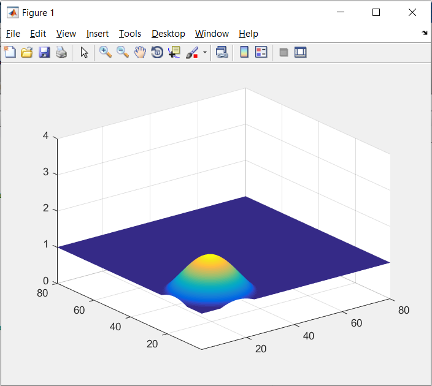
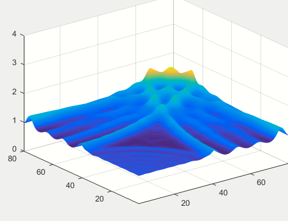
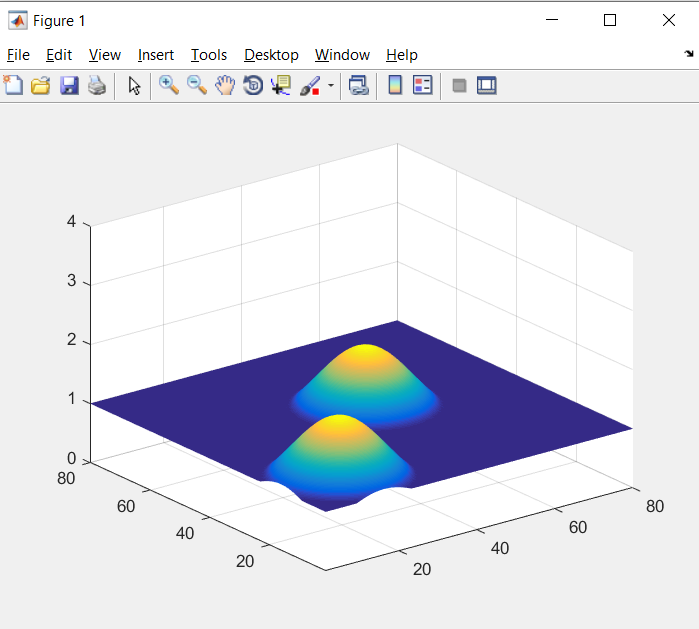
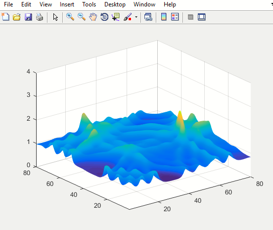

## Báo cáo nhóm 1

Thành viên nhóm:

Mai Văn Tường 20205138

Nghiêm Đình Minh 20200401

Nguyễn Bá Hoàng 20204976

Phạm Vũ Hoàng 20208000

Phạm Tuấn Anh 20205054

### Chủ đề 5: Simulation of Shallow Water Equations

#### 1. Giới thiệu bài toán 

Nhiều hiện tượng trong tự nhiên (sóng trong bồn tắm, sóng ở mặt hồ, trong khí quyển, sóng thần,...) có thể được mô hình hóa dưới dạng các phương trình nước nông (shallow water equations - SWEs).

Các phương trình nước nông - SWEs mô phỏng sự lan truyền của các nhiễu động (disturbances) trong nước và các chất lỏng không nén được (incompressible fluids) khác. Giả thiết ban đầu là độ sâu của chất lỏng nhỏ hơn rất nhiều lần so với chiều dài sóng của nhiễu động. Lấy ví dụ, chúng ta thường không nghĩ rằng Ấn Độ Dương nông. Thực tế độ sâu của nó chỉ vào khoảng 2 km - 3 km. Trận sóng thần ở Ấn Độ Dương vào ngày 26/12/2004 gây ra những con sóng dài hàng chục hoặc hàng trăm ki-lô-mét. Vậy nên phương trình nước nông xấp xỉ một mô hình hợp lý trong tình huống này.

SWEs được phái sinh từ nguyên lý bảo toàn khối lượng và động lượng, bỏ qua các yếu tố ngoại lực khác thì SWE có dạng một hệ phương trình đạo hàm riêng:
$$
\begin{align}
\frac{\partial h}{\partial t} + \frac{\partial uh}{\partial x} + \frac{\partial vh}{\partial y} = 0\\
\frac{\partial vh}{\partial t} + \frac{\partial (u^2h+\frac{1}{2}gh^2)}{\partial x} + \frac{\partial uvh}{\partial y}=0\\
\frac{\partial vh}{\partial t}+\frac{\partial uvh}{\partial x}+\frac{\partial (v^2h+\frac{1}{2}gh^2)}{\partial y}=0
\end{align}
$$
Các biến tự do:

+ t - thời gian

+ x - tọa độ của chất điểm theo Ox

+ y - tọa độ của chất điểm theo Oy

Các biến phụ thuộc:

+ h=h(x,y,t) - chiều cao của cột sóng so với bề mặt

+ u=u(x,y,t) - vận tốc theo phương x

+ v=v(x,y,t) - vận tốc theo phương y

Hằng số:

+ g - gia tốc trọng 

#### 2. Xây dựng mô hình 

$$
\begin{align}
U&=\begin{pmatrix}h\\uh\\vh\end{pmatrix}\\
F(U)&=\begin{pmatrix}uh\\u^2h+\frac{1}{2}gh^2\\uvh\end{pmatrix}\\
G(U)&=\begin{pmatrix}vh\\uvh\\v^2h+\frac{1}{2}gh^2\end{pmatrix}
\end{align}
$$

SWE trở thành:
$$
\frac{\partial U}{\partial t}+\frac{\partial F(U)}{\partial x}+ \frac{\partial G(U)}{\partial y}=0
$$
 U là một ma trận chuyển vị 2 chiều. Nó được sử dụng để vẽ đồ thị

 F là một ma trận 2 chiều lưu trữ vận tốc của các điểm theo trục Ox

G là một ma trận 2 chiều lưu trữ vận tốc của các điểm theo trục Oy

#### 3. Xây dựng thuật toán

$$
\frac{\partial U}{\partial t}+\frac{\partial F(U)}{\partial x}+ \frac{\partial G(U)}{\partial y}=0\\
\begin{align}
\Leftrightarrow\frac{\partial U}{\partial t}=&-\frac{\partial F(U)}{\partial x} -\frac{\partial G(U)}{\partial y}\\
\Leftrightarrow\frac{U^{t+\Delta t}-U^{t-\Delta t}}{2\Delta t}=&-\frac{F^t(U_{x+\Delta x})-F^t(U_{x-\Delta x})}{2\Delta x}\\
&-\frac{G^t(U_{y+\Delta y})-G^t(U_{y-\Delta y})}{2\Delta y}\\
\Leftrightarrow U^{t+\Delta t}=&\space U^{t-\Delta t}\\
&-\frac{\Delta t}{\Delta x}[F^t(U_{x+\Delta x})-F^t(U_{x-\Delta x})]\\
&-\frac{\Delta t}{\Delta y}[G^t(U_{y+\Delta y})-G^t(U_{y-\Delta y})]
\end{align}
$$

Từ đây có thể tính được xấp xỉ được các giá trị của U theo từng bước thời gian.

**Điều kiện tại biên:**

Vận tốc bị đảo ngược:

Khi va vào trục Ox
$$
v_2=-v_1
\\u_2=u_1
$$
Khi va vào trục Oy
$$
v_2=v_1
\\u_2=-u_1
$$
**Khởi tạo điều kiện ban đầu:**
$$
U(x,y,0)=0\\
V(x,y,0)=0\\
H(x,y,0)=0
$$

#### 4. Kết quả mô phỏng

Khởi tạo với 1 cột sóng:

		

​	Khởi tạo với 2 cột sóng:

